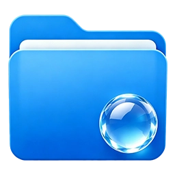
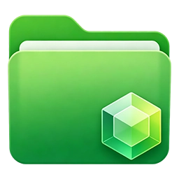
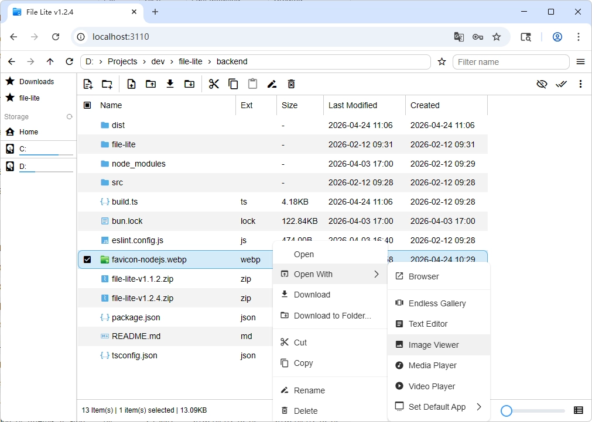

# File Lite

[中文](./README.md) | English

<p align="center">
  
  &nbsp;&nbsp;
  
</p>

<p align="center"><b>Web file manager</b> · Vue 3 + TypeScript</p>

---

## Dual backends

The project ships **two server implementations** that share the same frontend—pick one for your deployment:

| | **Node.js backend** (`backend/`) | **Go backend** (`backend-go/`) |
|:---|:---|:---|
| **Stack** | Express.js + TypeScript, developed and bundled with Bun | Echo, single static binary |
| **Typical use** | `npm i -g file-lite`, rapid iteration, script-friendly workflows | Low footprint, containers / edge, single-binary distribution |
| **Docs** | Development & config below | [backend-go/README.md](backend-go/README.md) |

> Frontend for the Go build: run `frontend:build-go` first so static assets land in `backend-go/frontend/` (see the Go README).

---



- **Bundle size**: single artifact stays around **20MB** or less
- **Features**
  - Files & folders: create, delete, rename, move, copy
  - Transfers: batch upload, upload folder, download, download folder as ZIP
  - Text editor
  - Preview: images, video, audio; **music player** with **playlist, cover art, and lyrics**
  - Video: toggle **ArtPlayer.js** vs **native `<video>`** from the app menu (preference persisted)
  - **Endless Gallery**: vertical, short-video-style feed of supported images / videos / audio in the current folder, with touch and keyboard / mouse navigation
  - Explorer: per-path layout & sort persistence, default app per file extension, and more
- **Security**
  - Password auth; optional IP ban after repeated failed logins
  - Configurable allowed root path scope
  - HTTPS including self-signed certificates
  - Request rate limiting

## Installation

```shell
# Global install (Windows may require administrator privileges)
npm i -g file-lite

# Run
file-lite

# Uninstall
npm uninstall -g file-lite
```

## Development

Use **Bun** for installs and scripts. The **default build targets the Node.js runtime** (`backend` embeds the frontend).

```shell
# Node.js backend
cd backend
bun i
bun run dev
bun run build
```

```shell
# Frontend
cd frontend
bun i
bun run frontend:dev
bun run frontend:build
```

```shell
# One-shot build (backend bundles frontend)
cd backend
bun run build:auto

cd dist
node file-lite.min.mjs
```

- **Go backend**: build steps and `frontend:build-go` are documented in [backend-go/README.md](backend-go/README.md)

## Configuration

- Config file path: `${cwd}/data/config.json`
- Type reference: [IConfig](backend/src/config/types.ts)
- Environment variables example: [.env.development](./backend/.env.development)
- [Generate and trust self-signed certificates with mkcert](./docs/mkcert.md)
