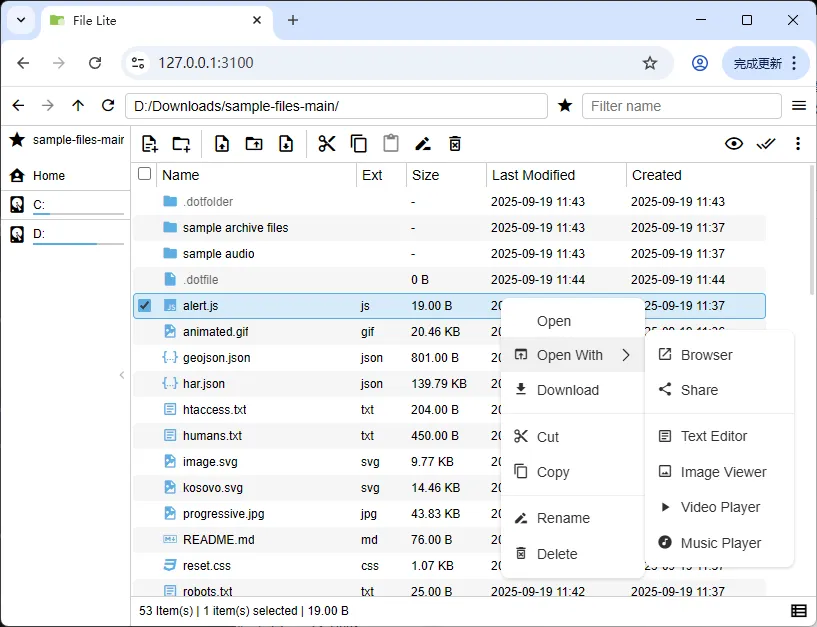

# File Lite

[中文](./README.md) | English

Web file manager, tech stack Express.js + TypeScript + Vue 3



- Bundle size: under 10MB
- Features
  - Support file creation, deletion, renaming, moving, copying
  - Support batch file upload, upload folder, download, download folder as zip
  - Support text editing, image, video, audio file preview
- Security
  - Support password authentication, support banning IP after exceeding password error times
  - Support limiting path access range
  - Support HTTPS protocol (using self-signed certificate)
  - Support access frequency limit

## Installation

```shell
# Global installation (Windows requires administrator privileges)
npm i -g file-lite

# Run (Note: will create a data folder in the current directory to store configuration files)
file-lite
```

## Development

Using bun to develop and compile, the final product runs in the Node.js environment

```shell
# backend
cd backend
bun i
bun run dev
bun run build
```

```shell
# frontend
cd frontend
bun i
bun run frontend:dev
bun run frontend:build

```shell
# auto build
cd backend
bun run build:auto

cd dist
node file-lite.min.mjs
```

- [go backend](./backend-go)

## Configuration

- Configuration file path: `${cwd}/data/config.json`
- Configuration document: [IConfig](./backend/src/enum/config.ts)
- Supported environment variables example [.env.development](./backend/.env.development)
- [Generate and trust self-signed certificate using mkcert](./docs/mkcert.md)
