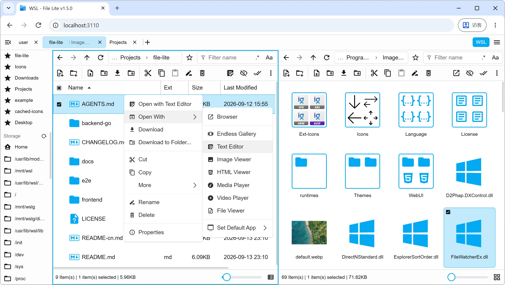
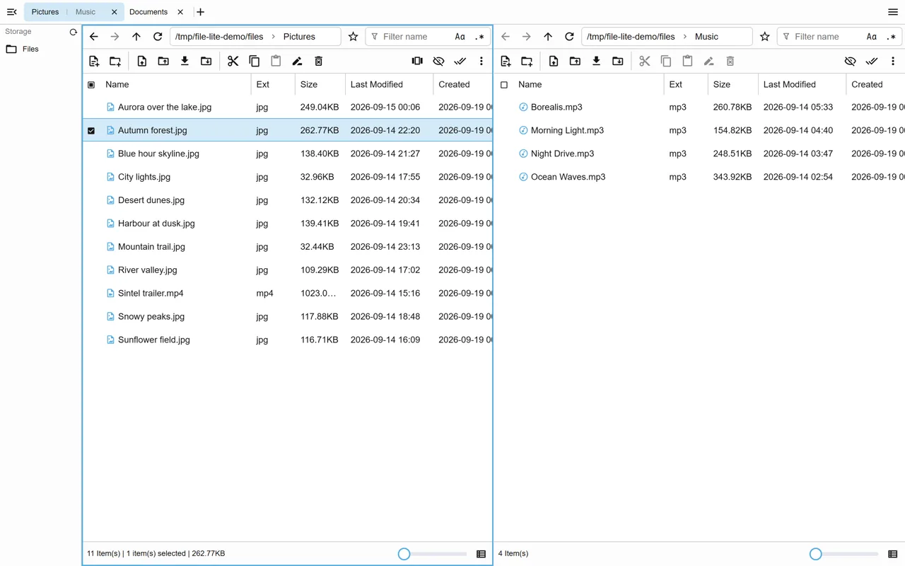
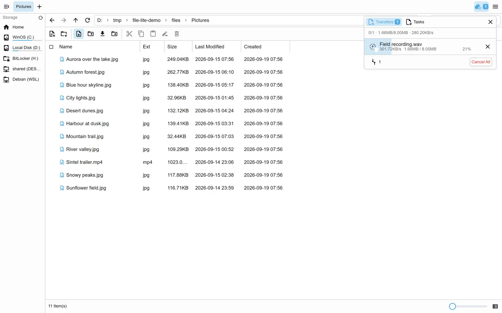
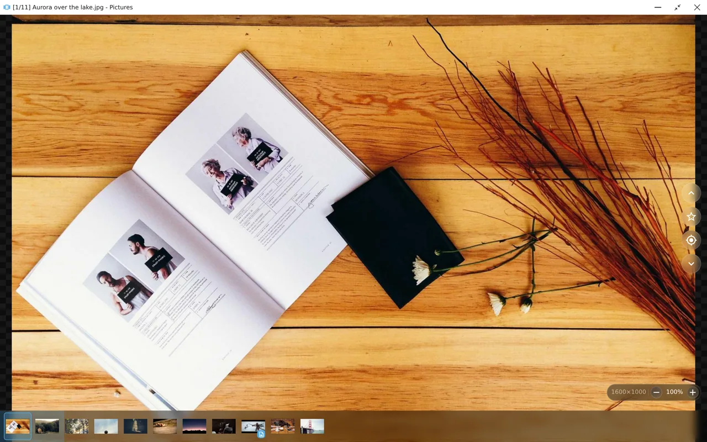
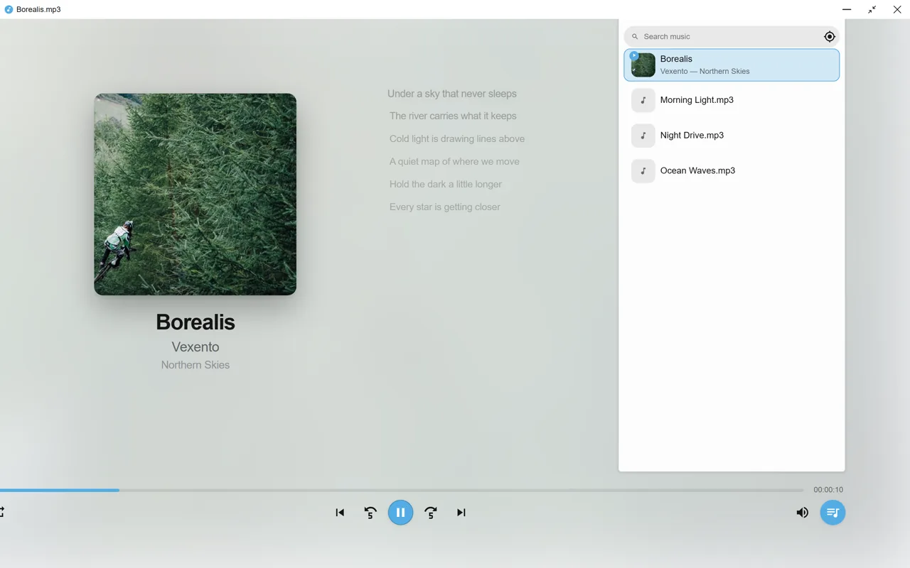
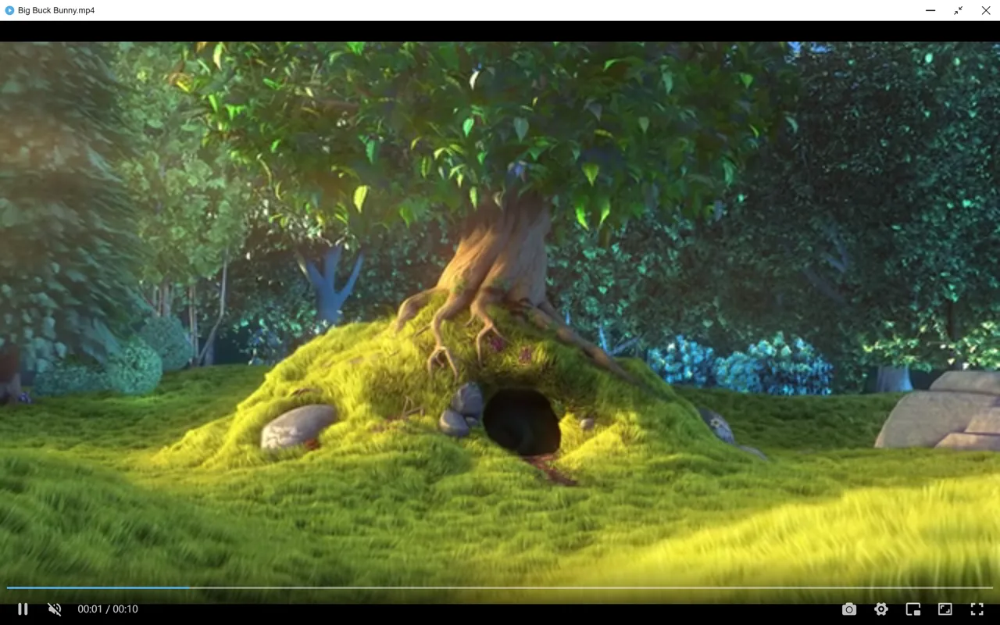
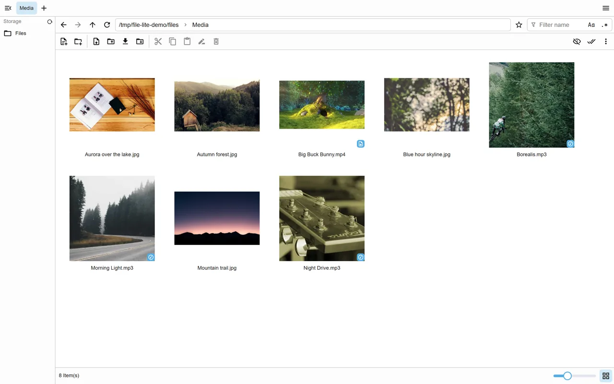
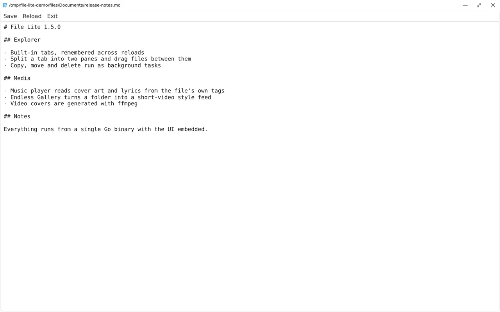
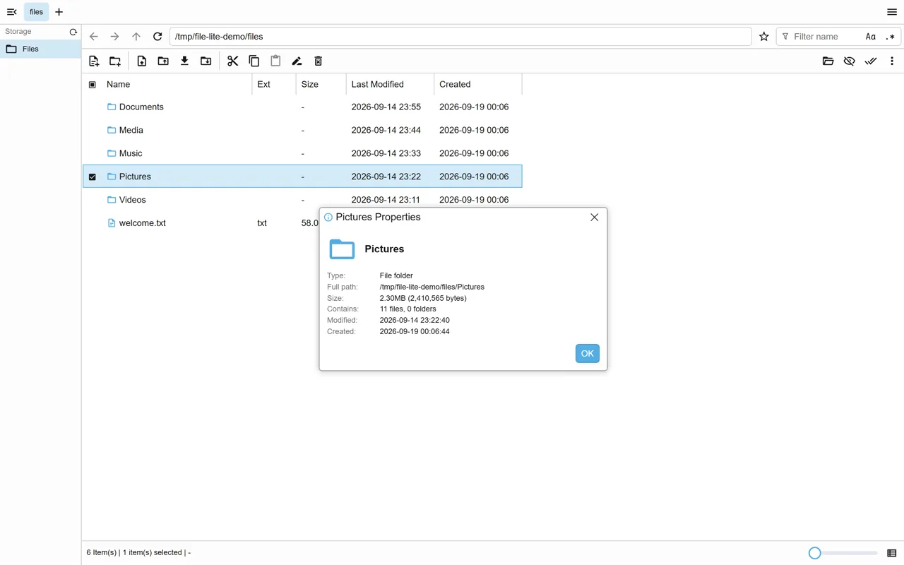

# File Lite

[中文](./docs/zh-CN/README.md) | English


**A lightweight, multi-purpose web file manager** · Vue 3 + TypeScript + Go

> This is a Vibe Coding open-source project. (Early versions were hand-written.) You’re welcome to use it and provide feedback, but stability is not promised, and the author reserves the right to rewrite it at any time.

---




| Screenshot                                                                  | Feature                                                                                                                                                                          |
| --------------------------------------------------------------------------- | -------------------------------------------------------------------------------------------------------------------------------------------------------------------------------- |
|                  | **Tabs & split view**: Chrome-like tabs with a Total Commander-style multi-pane view, horizontal and vertical, where files can be dragged straight from one pane into the other. |
|  | **Transfers & background tasks**: Uploads and downloads, while copy, move and delete run on the server — with progress and cancel, gathered in the top-right panel.              |
|                         | **Endless Gallery**: A short-video-style vertical feed of the images, videos and audio in the current folder, with touch, wheel and keyboard navigation, and a collect list.     |
|                       | **Music player**: Playlist, embedded cover art and synced lyrics.                                                                                                                |
|                       | **Video player**: ArtPlayer or the native `<video>` element, switchable from the app menu, remembering the last opened file.                                                     |
|              | **Previews & thumbnails**: Image previews, video first frames (ffmpeg) and audio cover art are all generated by the server and cached in the browser.                            |
|                         | **Text editor**: Edit and save text files right in the browser.                                                                                                                  |
|                    | **Windows-style properties**: Built-in apps support multi-window interaction and can be minimised.                                                                               |


- **Backend**: a single Go (Echo) server, shipped as one static binary with the UI embedded
- **Bundle size**: about **10MB**
- **Features**
  - Tabs and split view, list or grid, favourites and drives
  - Network shares and WSL distributions in the sidebar
  - Create, rename, copy, move and delete; drag-and-drop upload and download, including a folder as a ZIP
  - Compress and extract with 7-Zip when it is installed, including a password and a choice of archive type ([7-Zip](./docs/design/7zip.md))
  - Image, video and music preview, and a text editor
  - Endless Gallery: a vertical feed of the current folder
  - Light, dark and system themes
  - Plugins ([prebuilt plugins](./plugins-repo/README.md))
- **Security**
  - Password or Ticket login
  - Optional IP allowlist ([IP allowlist](./docs/ip-allowlist.md))
  - HTTPS, including a self-signed certificate ([HTTPS](./docs/ssl.md))


## Installation

Download the archive for your platform from [GitHub Releases](https://github.com/canwdev/file-lite/releases), unzip it and run the binary.

On Windows, unzip the archive and double-click `file-lite-go.exe`.

```shell
# Linux amd64
unzip file-lite-linux_amd64-v*.zip
cd linux_amd64
./file-lite-go
```

The console prints a ready-to-open URL, and the first run needs no password — the `ticket` in that link is the credential:

```text
Listening on: 0.0.0.0:3111
http://192.168.1.10:3111?ticket=a1b2c3d4
```

Settings live in `<cwd>/file-lite/config.json`. The login password is the `password` field; if it is empty, one is generated and saved. The console does not print it.

## Development

Use **Bun** for the [frontend](./frontend/README.md) and **Go 1.20+** for the [backend](./backend-go/README.md).

```shell
# Backend: hot-reload dev server on port 3111
cd backend-go
bun i
bun run dev
```

```shell
# Frontend: Vite dev server on port 3110, proxies /api to the backend
cd frontend
bun i
bun run dev
```

```shell
# Package the current platform: builds the frontend, the Go binary and the release zip
cd backend-go
bun run build
```


## Documentation

- [AGENTS.md](./AGENTS.md)
- [CHANGELOG.md](./CHANGELOG.md)
- [Configuration](./docs/config.md)
- [HTTPS](./docs/ssl.md)
- [IP allowlist](./docs/ip-allowlist.md)
- [Prebuilt plugins](./plugins-repo/README.md)
- [Plugins](./docs/design/plugins.md)
- [Tabs](./docs/design/explorer-tabs-design.md)
- [Background file operations](./docs/design/async-file-operations-ws-design.md)
- [7-Zip](./docs/design/7zip.md)
- [Thumbnails](./docs/design/thumbnails.md)
- [Storage and network paths](./docs/design/vfs-abstraction-design.md)
- [End-to-end tests](./e2e/README.md)

