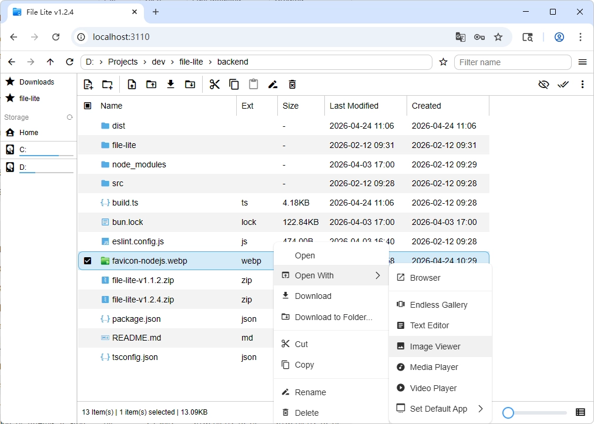

# File Lite

[中文](./README-cn.md) | English

<p align="center">
  
</p>

<p align="center"><b>Web file manager</b> · Vue 3 + TypeScript + Go</p>

---



- **Backend**: a single Go (Echo) server, shipped as one static binary with the UI embedded
- **Bundle size**: single artifact stays around **20MB** or less
- **Features**
  - Files & folders: create, delete, rename, move, copy
  - Transfers: batch upload, upload folder, download, download folder as ZIP
  - Text editor
  - Preview: images, video, audio; **music player** with **playlist, cover art, and lyrics**
  - Video: toggle **ArtPlayer.js** vs **native `<video>`** from the app menu (preference persisted)
  - **Endless Gallery**: vertical, short-video-style feed of supported images / videos / audio in the current folder, with touch and keyboard / mouse navigation
  - Explorer: per-path layout & sort persistence, default app per file extension, and more
- **Security**
  - Password login issues JWT session tokens with a 1-year expiry
  - Console URLs use a short-lived `ticket` login parameter with a 2-minute TTL; printing URLs again generates a new `ticket`
  - “Remember login status” supports persistent cookies or browser-session cookies
  - Optional IP ban after repeated failed logins
  - Configurable allowed root path scope
  - Optional IP-range allowlist (`allowedCIDRs`)
  - HTTPS including self-signed certificates
  - Login attempt rate limiting

## Installation

Download the archive for your platform from [GitHub Releases](https://github.com/canwdev/file-lite/releases), unzip it and run the binary.

```shell
# Example: Linux amd64
unzip file-lite-linux_amd64-v*.zip
cd linux_amd64
./file-lite-go
```

## Development

Use **Bun** for the frontend and **Go 1.20+** for the backend.

```shell
# Backend: hot-reload dev server on port 3111
cd backend-go
bun i
bun run dev
```

```shell
# Frontend: Vite dev server on port 3110, proxies /api to the backend
cd frontend
bun i
bun run dev
```

```shell
# Package the current platform: builds the frontend, the Go binary and the release zip
cd backend-go
bun run build
```

- **Go backend**: build steps and `bun run build:all` are documented in [backend-go/README.md](backend-go/README.md)

## Configuration

- Config file path: `<cwd>/file-lite/config.json` (override the directory with `FILE_LITE_DATA_BASE_DIR`)
- Type reference: `Cfg` in [backend-go/config/config.go](backend-go/config/config.go)
- [Generate and trust self-signed certificates with mkcert](./docs/mkcert.md)
- [Restrict access to specific IP ranges (`allowedCIDRs`)](./docs/ip-allowlist.md)
- If `password` is empty, File Lite generates a random password; when the config file already exists, the generated password is written back
- `jwtToken` is the JWT signing secret; when an existing config file has an empty value, it is generated and written back
- The console does not print JWTs or signing secrets; check the config file for the login password
