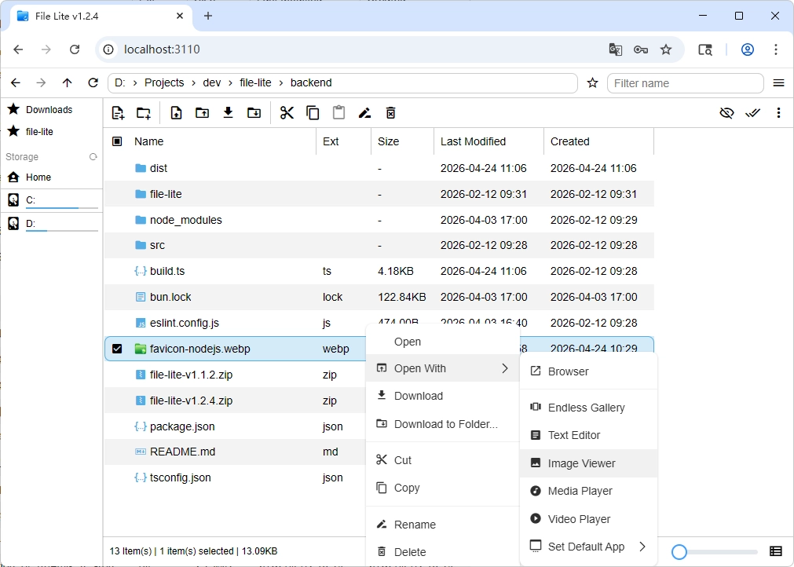

# File Lite

Web file manager, tech stack Express.js + TypeScript + Vue 3



## Installation

```shell
# Global installation (Windows requires administrator privileges)
npm i -g file-lite

# Run
file-lite

# Uninstall
npm uninstall -g file-lite
```

## Development

Using bun to develop and compile, the final product runs in the Node.js environment

```shell
# backend
bun i
bun run dev
bun run build
```