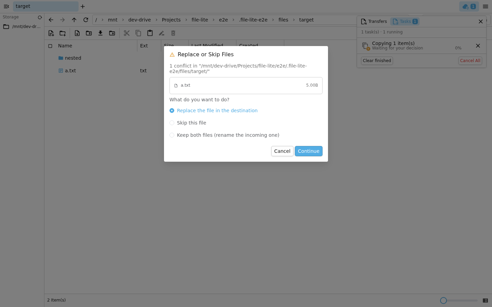
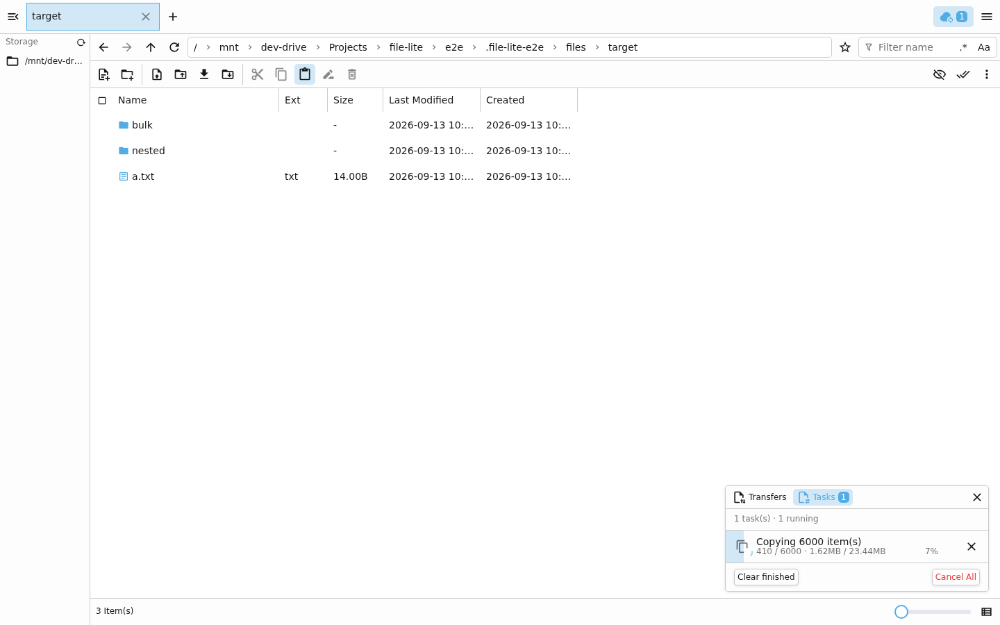
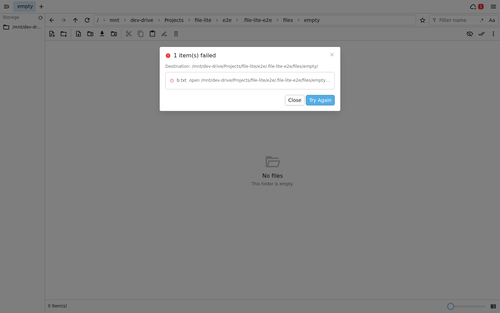
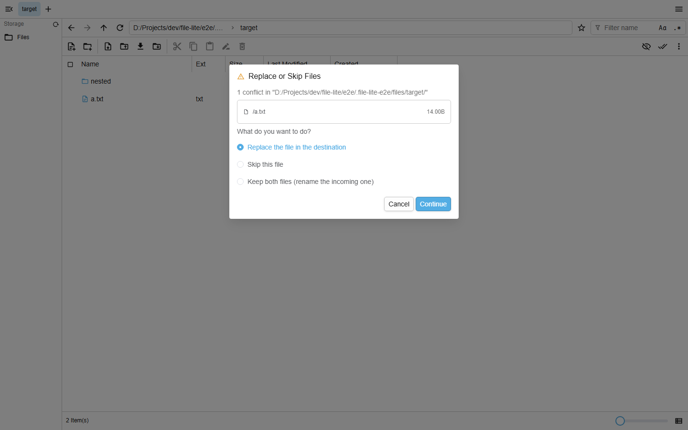
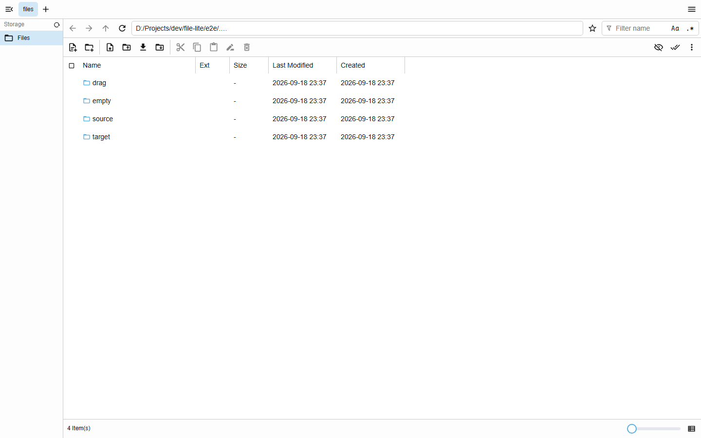

# 前端 UI 端到端测试方法与结果

> 测试子项目：[`e2e/`](../e2e/README.md)（Playwright，17 个用例，约 50 秒）
> 运行：`cd e2e && bun install && bun run install:browser && bun run test`

本文说明**怎么测的**、**测了什么**，以及**为什么这么测**。截图由测试自己产出，
不是手工截的——用例跑到关键界面时调用 `screenshot()` 落盘，所以只要测试通过，
截图就一定与当前代码一致。

## 为什么单独建一个子项目

- **测的是构建产物，不是源码。** 后端用 `go:embed` 把 `frontend-assets.tar.gz` 编进二进制，
  所以 E2E 必须走「`vite build` → 打包 tar.gz → `go build`」这条真实链路。
  测试脚本把这三步固化下来，避免出现「改了前端但二进制里还是旧页面」这种假通过。
- **依赖与环境隔离。** Playwright 与 Chromium 装在 `e2e/node_modules`、`e2e/.browsers`，
  不污染 `frontend` 的依赖树，也不写 `HOME`（沙箱 / CI 里往往不可写）。
- **夹具可随意破坏。** 数据目录、被操作的文件都在 `e2e/.file-lite-e2e/`（已 gitignore），
  测试需要制造「目标目录不可写」「同名文件已存在」这类场景，改权限、删文件都不影响仓库。

## 启动方式

```
playwright.config.ts 的 webServer
        │
        ▼
scripts/start-app.mjs
        ├─ assertPortFree()          端口被占说明有孤儿进程 → 直接报错，不静默连旧进程
        ├─ build-app.mjs             前端 build → frontend-assets.tar.gz → go build
        ├─ fixture.mjs              重建夹具目录 + config.json（固定密码 / safeBaseDir 指向夹具）
        └─ spawn(二进制)              Playwright 轮询 /api/ 就绪，测试结束关掉
```

夹具文件树（`tests/helpers.ts` 依赖这个结构）：

```
files/
├── source/           a.txt(alpha) b.txt(beta) note.md nested/deep.txt
├── target/           a.txt(existing-alpha) nested/     ← 预置同名文件，冲突用例靠它
└── empty/            （空目录，用来制造「不可写」的失败场景）
upload/               a.txt（与服务端同名）、fresh.txt
```

用例之间**共用同一台服务器和同一份磁盘**，所以每个用例开始前会
`resetTargetDirs()` 复位 `target` / `empty`，并在登录后清掉历史任务，
避免上一个用例留下的文件把下一个用例变成「同名冲突」场景。

## 几个刻意的测试写法

**1. 复制/粘贴走工具栏按钮，不走 Ctrl+C / Ctrl+V。**
快捷键要通过 `document.activeElement.closest('[data-shortcut-scope]')` 解析作用域，
焦点稍微不在列表上就**静默失效**（表现为「什么都没发生」，非常难查）。
按钮走的是同一段 `handleCopy` / `handlePaste` 逻辑，稳定得多；快捷键本身由
`use-shortcut` 的单元逻辑覆盖。

**2. 导航必须等面包屑真的切过去。**
`openFolder()` 一开始只等「旧的一行消失」，但目标行本来就不在当前目录里，
这个条件会立刻成立——于是粘贴有可能还在上一个目录执行。现在它等地址栏最后一段
面包屑变成目标目录名。

**3. 任务结束后面板会自动收起，所以断言看磁盘而不是看已经隐藏的行。**
成功的任务跑完（或被取消）后，它的行会从列表移除，右下角的传输面板就像资源管理器一样收起。
失败/取消时用失败清单弹窗呈现。因此 `expect.poll(() => fs.readFileSync(...))` 是主力断言，
`toBeHidden()` 用来验证「面板确实自动收起了」。

**4. 「不留半个文件」在 UI 层也要验一次。**
取消一个大目录的复制后，遍历目标目录：既不能有 `.fl-part-*` 临时文件，
每个已存在的文件也必须是完整大小（不能出现半个文件）。

## 测试发现的真实缺陷

这套 UI 测试不是「补个覆盖率」，它在开发过程中直接抓到了三个真 bug
（都是单测和 WS 冒烟测不到的，因为它们只在真实前端里才暴露）：

| 缺陷 | 后果 | 修复 |
| --- | --- | --- |
| 前端没有处理任务的创建事件，`update` / `done` 在「查无此任务」时被丢掉 | 新任务**永远不会出现在界面上**，进度条、取消、失败清单全都无从触发 | 后端新增 `created` 广播（带完整快照），前端 upsert |
| 初始任务快照只在 `sharedWsStatus` 变化时拉取 | 设置模块先连上 WS 时状态已是 `connected`，watch 不触发 → **打开应用看不到任何进行中的任务** | watch 加 `immediate: true` |
| 任务窗口居中悬浮且结束后不关闭 | 一个浮动窗口**一直盖住文件列表**，拦截点击 | 全部结束且无失败时自动收起；状态栏加「Tasks」入口可重开。后来又干脆换成固定在右下角、不阻挡列表的面板（双页签 `Transfers` / `Tasks`） |

## 截图

### 同名冲突：`Replace or Skip Files`

服务端先预扫描、任务暂停等待决策，**此刻磁盘还没有任何改动**（测试里直接断言了这一点）。
弹窗期间可以 Cancel：任务会被取消并直接移出列表，不留等待决策的行，磁盘保持原样。



### 任务进度与取消

复制 6000 个小文件时的进度条：`1156 / 6000 · 9.04MB / 23.44MB · 39%`。
截图里的面板停在 `Tasks` 页签（服务端任务），取消按钮就在行内；取消后任务直接移出列表、面板自动收起，
测试随即校验目标目录里没有半个文件。



### 失败清单与重试

把目标目录设为不可写制造真实失败：清单列出是哪一项、为什么失败，
`Try Again` 只重跑失败项（修好权限后应当补齐）。



### 上传同名冲突

上传（HTTP 字节流 + 客户端队列）复用同一个弹窗：入队前向服务端批量确认路径是否存在，
文件夹上传的嵌套路径也能覆盖到。



### 主界面



## 与后端测试的分工

| 层次 | 位置 | 覆盖 |
| --- | --- | --- |
| 文件操作原语 | `backend-go/fileops/*_test.go` | 策略矩阵、**取消后无残留 / 无半个文件**、结果集上限、扫描、Windows 合并语义 |
| 任务状态机 | `backend-go/tasks/manager_test.go` | 冲突暂停 / 决策 / 取消 / TTL、重试只挑失败项、创建必须广播完整快照 |
| HTTP 接口 | `backend-go/routes/upload_test.go` | 上传默认拒绝覆盖 / overwrite / keep-both、保留前缀、启动不死锁 |
| 真实 WS 冒烟 | 手工脚本（本文未收录） | 冲突→决策→执行、运行中取消、中断上传、临时文件不可见 |
| **浏览器 UI** | **`e2e/`（本文）** | **上面全部行为的用户可见路径**：弹窗、双页签面板与进度条、取消、失败清单、跨窗口可见、原地粘贴、下载文件名 |

上层不重复下层：E2E 不验证策略矩阵的每个组合（那是单测的事），只验证
「用户点得到、看得见、结果对」。
